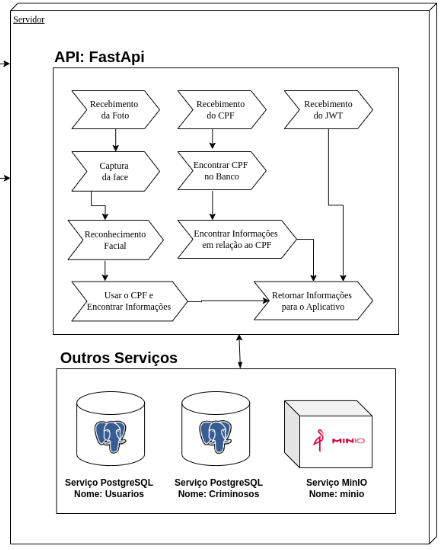

<h1 align="center"> VisionApp - API </h1>

  

## Sumário

* [Integrantes](#integrantes)
* [Descrição](#descrição)
* [Requisitos](#requisitos)
* [Tecnologias](#tecnologias)
* [Fluxo do Software](#fluxo-do-software)
* [Dificuldades](#dificuldades)
* [Resultados](#resultados)
* [Como_Usar](#como_usar)
* [Conclusao](#conclusao)

## Integrantes

- Anderson do Vale - [and3510](https://github.com/and3510) 
- Beatriz Barreto - [whosbea](https://github.com/whosbea)
- Cristovam Paulo - [cristovam10000](https://github.com/cristovam10000)
- Gustavo do Vale - [gustavodovale](https://github.com/gustavodovale)
- Lucas Cesar

## Descrição

Este projeto consiste em uma API desenvolvida com FastAPI para reconhecimento facial, armazenamento de informações biométricas e gerenciamento de registros criminais. A API utiliza tecnologias modernas para garantir alta performance, precisão e segurança no processamento de dados sensíveis.

## Requisitos

### Requisitos Funcionais (RF)

| Código | Requisito |
|--------|-----------|
| RF01 | O sistema deve permitir o **cadastro de criminosos** com os seguintes dados: CPF, nome completo, nome da mãe e imagem facial. |
| RF02 | O sistema deve permitir a **extração automática da face** a partir da imagem enviada. |
| RF03 | O sistema deve **gerar e armazenar um vetor de 128 dimensões** representando a face da pessoa. |
| RF04 | O sistema deve permitir o **registro de ficha criminal** apenas se o CPF já estiver cadastrado como pessoa física. |
| RF05 | O sistema deve permitir o **reconhecimento facial** por similaridade com vetores já cadastrados. |
| RF06 | O sistema deve aplicar **algoritmo de ajuste de iluminação** caso a imagem tenha baixa ou alta luminosidade. |
| RF07 | O sistema deve permitir a **consulta de informações por CPF**, retornando se há ficha criminal e se está foragido. |
| RF08 | O sistema deve permitir o envio de imagem por requisição (POST) para verificar a presença de um rosto válido. |
| RF09 | O sistema deve realizar **autenticação de usuários via Firebase**. |
| RF10 | O sistema deve gerar um **token JWT** com validade temporária após autenticação via Firebase. |
| RF11 | O sistema deve segmentar as informações em dois bancos: **usuarios** e **pessoas procuradas por crimes**. |

### Requisitos Não Funcionais (RNF)

| Código | Requisito |
|--------|-----------|
| RNF01 | O sistema deve ser desenvolvido em **Python**, utilizando **FastAPI** como framework principal. |
| RNF02 | O banco de dados utilizado deve ser o **PostgreSQL** com suporte à extensão `vector` para armazenar vetores. |
| RNF03 | O sistema deve usar **OpenCV, Dlib e face_recognition** para manipulação e vetorização facial. |
| RNF04 | Todas as comunicações entre cliente e servidor devem ocorrer via **HTTPS**. |
| RNF05 | O sistema deve seguir os princípios de **segurança de dados**, evitando exposição de informações sensíveis. |
| RNF06 | O sistema deve garantir **alta disponibilidade e escalabilidade**, podendo operar em ambientes com múltiplas requisições simultâneas. |
| RNF07 | O tempo médio de resposta para reconhecimento facial deve ser inferior a **3 segundos**. |
| RNF08 | A API deve seguir boas práticas REST, com respostas em **formato JSON**. |
| RNF09 | O sistema deve estar preparado para lidar com **falhas de rede, imagem inválida ou ausência de rosto**. |

## Tecnologias

- Python
- JWT
- Firebase
- Docker
- Postgresql
- Minio

### Bibliotecas principais
FastAPI – Framework rápido e moderno para construção de APIs com Python.

OpenCV – Leitura e pré-processamento de imagens.

dlib – Detecção facial por retângulo delimitador.

face_recognition – Geração de vetores faciais (descritores de 128 dimensões).

SQLAlchemy – ORM para integração com banco de dados relacional.

FireAuth - Para Autentição com FireBase

## Fluxo do Software

 

 Arquitetura do Sistema 

De acordo com diagrama da imagem, a autenticação é realizada via Firebase, garantindo o acesso seguro dos usuários por meio de tokens JWT. A API desenvolvida com FastAPI gerencia o recebimento de fotos, CPF e a autenticação, realizando o reconhecimento facial e a consulta de informações em bancos PostgreSQL e no serviço de armazenamento MinIO. O sistema permite identificar usuários ou suspeitos a partir da análise facial, cruzando dados com os cadastros existentes. Por fim, os resultados são retornados à aplicação móvel, completando o fluxo de verificação e resposta.

 

 Interface do FastApi para realização de Requisições 

A imagem apresenta a documentação da API desenvolvida com FastAPI, onde estão listadas as principais requisições que a aplicação móvel pode realizar. Entre elas, destaca-se o endpoint /auth/firebase, responsável pela autenticação via Firebase, e o ´/buscar-similaridade-foto´, que permite o envio de uma imagem para análise de similaridade facial. Além disso, o endpoint /buscar-ficha-criminal/{cpf} possibilita a consulta da ficha criminal a partir do CPF, enquanto o /usuario/perfil recupera os dados do perfil do usuário autenticado. Todas as rotas exigem autenticação, garantindo segurança nas interações entre o app e o servidor.

## Dificuldades

## Resultados

## Conclusao

